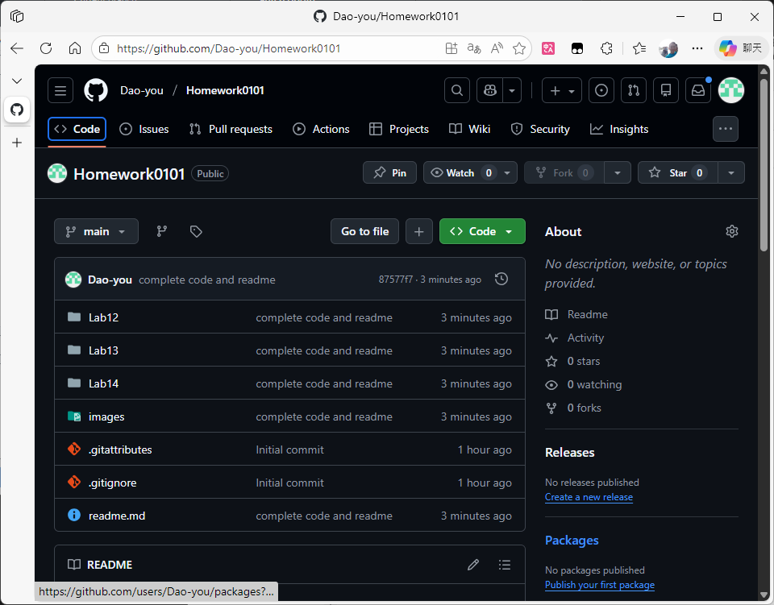
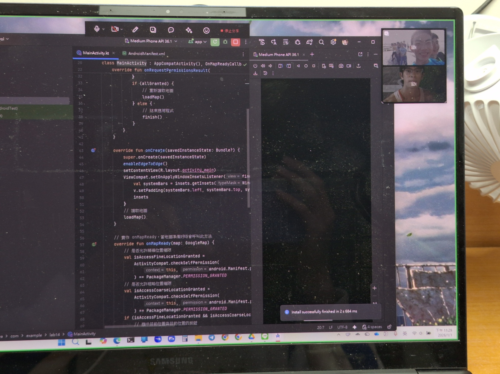

# kotlin 程式碼練習

## 心得

這次做的東西是 Servise、Broadcast、Map，可以開始對應用程式有更多實用的操作，也需要了解更多權限管理、Manifest 註冊等等相關知識，不再只是埋著頭寫程式而已了。感覺只是上課教的內容或老師寫的課本，會有點只是知道怎麼設定，卻不知道為什麼，後來才自己去查詢 Android Developer 的文件瞭解更多。

## Github

### 網址：
[https://github.com/Dao-you/Homework0101](https://github.com/Dao-you/Homework0101)

### 截圖：

# 讀書會

* 組員：方宇澤
* 討論時間：2025/12/23 22:00 ~ 23:30
* 地點：LINE 通話
* 討論主題：權限問題與 Google Map 的應用

